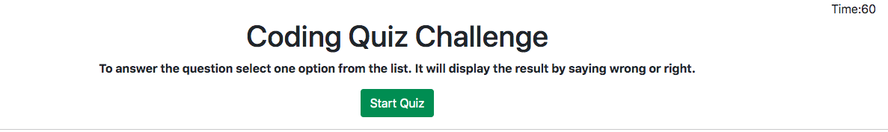
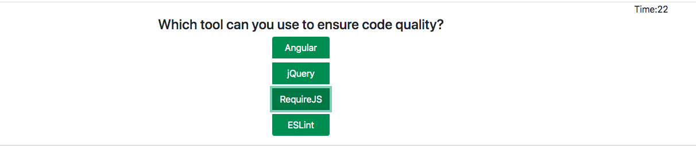

# Code Quiz
Build a timed coding quiz with multiple-choice questions. This app will run in the browser, and will feature dynamically updated HTML and CSS powered by JavaScript code that you write. It will have a clean, polished, and responsive user interface.

# Deployment
Link to the deployed website: https://deepali-gtech.github.io/code_quiz/

Below are the screen shorts for the website

### Opening Screen :

### Question Screen :

### Score Screen :

# Deployment Steps
1. In html file
Created div by using bootstrap css styling and declared id in html file.
2. In js file
Declared veriable in js file, build the function by assigning key and value to the function.
3. For questions created array and build function by passes these array